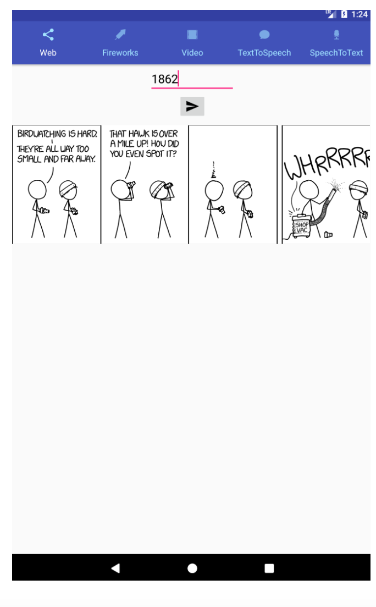

# Welcome to AndroidFeatureApp_AWS!

This is a proof of concept android app to utilize some of Android's built in hardware such as the microphone and speach to text fearures. In a tabular layout this app also plays mp4 video and makes AWS calls to retrieve comics to display them. Finally I also dabbled with animation in one of the tabs. Within the animation page, tapping on the screen will produce a custom animated firework explosion!  

